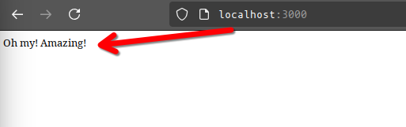
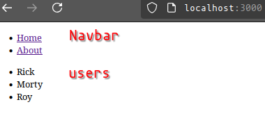

# View engines in express

There are various view engines, one of which is EJS. It shares a common syntax to HTML which makes it easy to get started with.

# Install

To install EJS on a existing express project, use npm

```bash
npm install ejs
```

Import nodes built-in path module, to allow us to set a path in the internal file structure of the project.

```javascript
const path = require('node:path');
```

Then enable ejs by setting the views path(where we will store the views we are going to create using ejs) as well as the view engine property of our express app

```javascript
app.set('views', path.join(__dirname, 'views'));
app.set('view engine', 'ejs');
```

# EJS syntax

EJS syntax boils down to using existing HTML while using `<%` `%>` tags to enable the use of javascript.

For example, let's make a `for` loop and use some variables in the HTML file using EJS

```javascript
<% const products = [bike, computer, potato, stick] %>

<ul>
<% products.map((product) => { %>
    <li><%= product %>s are neat </li>
<% }) %>
</ul>
```

Note the use of EJS syntax on each line where javascript is used.

# Using EJS with express

In order to use EJS with express, we should start by creating a views folder to hold our ejs views, with a template file called `index.ejs`.

```javascript
<html>
    <body>
        <%= message %>
    </body>
</html>

```

Then, in order to render the template file, we will use express res.render method during a application level route match to the index of the site `/` to return a rendered page, where the message variable has been passed as a prop.

```javascript
app.get('/', (req, res) => {
    res.render('index', { message: 'Oh my! Amazing! ' });
});
```

now, when ever this path is matched, EJS will create a HTML body to return, computing the javascript and dynamically replacing the message variable with our passed text!

Lets try it! Booting up the server, and attempting to enter the path `localhost:3000/` will give us:


**How does it work?**
When we decide to render a view, EJS is granted access to any properties from the object we pass into the `res.render` method, as well as Express's `res.locals` object. EJS will store the properties passed during res.render, e.g message, in this object.
Now, when rendering the view, we can access the `locals.message`, or simply `message` by including it in the EJS syntax `<%= message %>`

    NOTE - Attempting to access a variable that was not defined during res.render to the locals variable will result in a reference error.

## Reusable templates

A useful feature of EJS is the ability to include webpage components that can be used across different pages.

Examples include components liek a sidebar, header, or footer.

To insert components like these, we use the include command of ejs.

Lets make a component `navbar.ejs`, and place it into its own folder `components`

```javascript
<nav>
    <ul>
        <% for(let i = 0; i < links.length; i++) { %>
        <li>
            <a href="<%= links[i].href  %>">
                <span><%= links[i].text %></span>
            </a>
        </li>
        <% } %>
    </ul>
</nav>

```

    We iterate through a for loop using a passed links array, creating a list element with a link containing the url and text of that link.

and then `include` it in our ejs view, remember that navbar is in a nested director within views, so include the components part of the navigation to the navbar view

```javascript
<html>
    <head>
        <title>Homepage</title>
    </head>
    <body>
        <%- include('components/navbar', {links: links})
    </body>
</html>

```

And then pass a links array from `app.js` when rendering the view.

```javascript
const links = [
    {
        href: '/',
        text: 'Home',
    },
    {
        href: 'about',
        text: 'About',
    },
];
app.get('/', (req, res) => {
    res.render('index', { links: links });
});
```

Now, when rendering the index.ejs, we pass along the links array, this in turn is passed further to the included navbar, where the links are used to dynamically create nav links as list elements.

This is the basis of creating dynamic elements between pages and components

We define our links array in app.js
pass it to index on render
which passes it along to navbar as its included
which in turn renders a li element for each link using a for loop.

Let us try and do this again, but in a bit different way.

On the index page, we also wish to include a users array.
So below the links array, we will create another array with our users

```javascript
const users = ['Rick', 'Morty', 'Roy'];
```

This time, we will create a new view called user.ejs.
This view will hold only a single line in a list element

```javascript
<li><%= user %></li>
```

In our index.ejs we create a new unorganised list `<ul>` element
inside the `ul` element, we use a `forEach` loop to iterate through the `users` array.
For each iteration, we pass a value of the `users` array, named `user` into a new included view component `user`, each being a unique instance of `user.ejs`

```javascript
<ul>
  <% users.forEach((user) => { %>
    <%- include('components/users/user', {user: user}); %>
  <% }); %>
</ul>
```

Now, Rick, Morty, and Roy should appear when rendering the index.ejs view.

The main difference is how many ejs view components we render.

In our links example, we use a single instance of the `links` view to render all our components

A single instance of Navbar will display all links from the links array

```
[Navbar: <ul><li>Home</li>, <li>About</li><ul>]
```

Meanwhile, one instance of user.ejs will be used for each element of the users array and placed inside an unorganised list `ul`

```
<ul>
[user: <li>Rick</li>]
[user: <li>Morty</li>]
[user: <li>Roy</li>]
</ul>
```

Now, when we enter the index view of our application:


